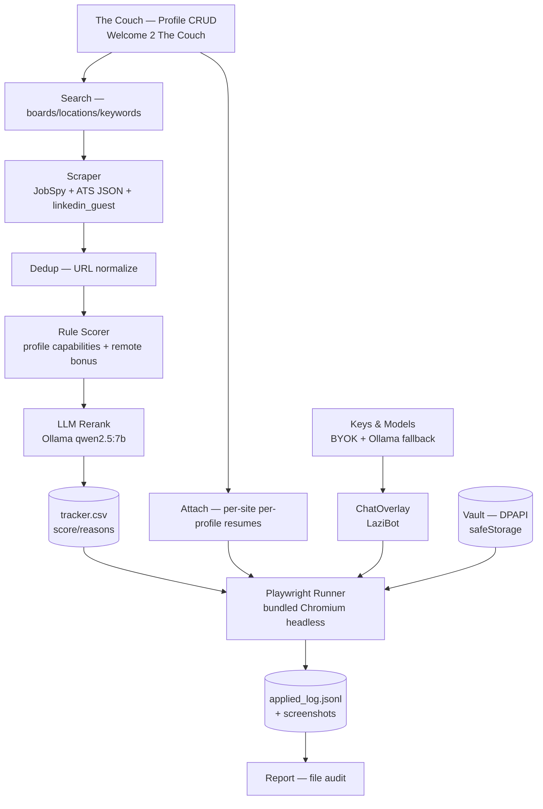
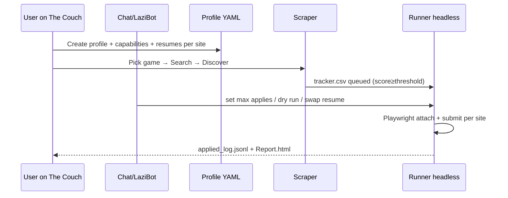

<<<<<<< HEAD
# improved-happiness — JobBot Desktop

> **Headless auto-apply job bot** — Electron desktop EXE with Playwright bundled Chromium, per-profile per-site resumes, DPAPI vault, and LaziBot on The Couch.

[](LICENSE)
[](https://electronjs.org)
[](https://playwright.dev)
[](https://www.typescriptlang.org)
[](https://python.org)

---

## Welcome 2 The Couch 🛋️

**The Couch** is the Command Center. **LaziBot** — fat, smudgy, no hard hat, no logo — lounges there from the **Monastery of Laziness** (`do the least, achieve the most`). He tapes `1 2 3 4` into OTP fields while you stay on the couch.

```
Profile → Game → Search → Attach (resumes per site per profile) → Run → Report
         ↑ ChatOverlay (ChatGPT-style, bottom-fixed, every page) talks to LLM
```

---

## Features

| Area | What it does |
|---|---|
| **Profiles — unlimited** | `config/profiles/<slug>.yaml` per person. No hardcodes. `The Couch` CRUD: name/headline/summary/years/skills + **Capabilities** (`Target Roles` top/mid/entry, `Keywords` include/exclude, `Remote`). Scorers read active profile. |
| **Resumes — unlimited per site per profile** | `AttachView` per-profile per-site. Each board (LinkedIn/Greenhouse/Workday/Indeed/FlexJobs…) gets its own list. Runner attaches the right file for active profile. |
| **Search — extensible** | `config/search.yaml` boards (12 built-in) + `Add Board` for any site (FlexJobs). Keywords unlimited, locations unlimited (`Remote USA`, `Remote FL`, etc.). Sliders for threshold/maxApply/delay/bonus. |
| **Vault — DPAPI** | Electron `safeStorage` (Windows Data Protection API) — OS-level, per-user, never leaves disk. `config/credentials/<board>.enc.yaml`. UI shows `••••`. Passkeys via Windows Hello headless. Not a browser store, not committed (`.gitignore`). |
| **Scraper** | `JobSpy` (concurrent multi-board) + `ATS` JSON (14 boards) + `linkedin_guest` fallback. Dedupe + rule scorer + Ollama `qwen2.5:7b` rerank. |
| **Headless apply** | Playwright **bundled Chromium** (not your Chrome) with `stealth`. Own internet. Per-site flows. Dry-run default. Screenshots + `applied_log.jsonl`. |
| **LaziBot + Chat** | Fat dirty bot SVG. ChatOverlay cemented at bottom like ChatGPT on every page. Talks to Ollama/BYOK, can `set max applies to 15`, `toggle dry run`, swap resumes. |
| **Game Selection** | 6 games (Supply Chain Conquest, Ops Command, Vendor Guild…) load keywords into Search. |
| **Design** | LinkedIn-inspired dark (cobalt `#0a66c2` accent, feed-card, top bar `in` logo, left rail) — dark is fixed constraint. |

---

## Architecture





---

## Stack

* **Desktop:** Electron 32 + Vite 5 + React 18 + TypeScript 5.5
* **Backend:** Python 3.12 + Playwright + PyYAML + Flask (sidecar `127.0.0.1:18765`)
* **Browser:** Playwright bundled Chromium (isolated, stealth) — not your Chrome
* **Secrets:** Electron `safeStorage` DPAPI (Windows), per-machine

---

## Install

```bash
# Node
npm install
npm run dev        # hot reload at http://localhost:5173

# Python
python -m venv venv
venv\Scripts\pip install playwright pyyaml flask jobspy
venv\Scripts\playwright install chromium
```

## Build EXE

```bash
npm run build      # tsc + vite + electron --dir
npm run build:win  # NSIS installer → release/
```

## Config — no secrets committed

* `config/profile.yaml` → `active_profile: default` (gitignored, personal)
* `config/profiles/<slug>.yaml` → your profile (gitignored except `default.yaml` template)
* `config/credentials/<board>.enc.yaml` → DPAPI encrypted logins (gitignored)
* `config/search.yaml`, `config/keys.yaml`, `config/attachments.yaml` → examples committed, your edits ignored if secret

Copy `config/profile.example.yaml` → `config/profiles/your-name.yaml`, fill it or use **The Couch** UI.

```bash
python backend/run_pipeline.py doall
python backend/applier/playwright_runner.py --headless --persona=default --max=20 --dry-run
```

---

## Security

See `SECURITY.md`. Local-only, DPAPI per Windows user, `master.csv` legacy import once, no plaintext logs, MIT — consumer trust via local-only guarantee. Passkeys via WebAuthn pause + Hello.

## Monastery of Lazi-Bot

High in the idle peaks, the Monastery of Laziness taught one principle: *do the least, achieve the most*. LaziBot was forged there — fat, smudgy, no hard hat, no logo. He stays on The Couch so you don't have to.

---

## License

MIT — `LICENSE` — Tre-Day. See `LICENSE` file.
=======
# improved-happiness
>>>>>>> 7ce8c4b6fa4ba9e711a18ae334f3a6affb174f7c
